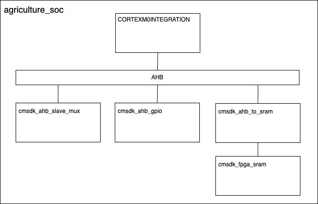

# agriculture-SoC

Our innovative SoC design for precision agriculture uses a mesh network of sensor-based devices to monitor and respond to changes in soil health, erosion, drought, and pest activity, enhancing reliability and eliminating single points of failure. Engineered for energy efficiency and continuous operation, it provides granular, real-time data directly from the field, optimizing resource use and surpassing traditional remote sensing methods for sustainable agriculture.

## Progress

Currently, the SoC implements the following architecture, using IP from the ARM CMSDK:

## Setup
The ARM IP used in this project is freely available under the ARM DesignStart Eval kit. Make sure to acquire the IP from ARM, along with a license. The DesignStart directory (e.g. `AT510-MN-80001-r2p0-00rel0`, etc) must be copied pointed to by the `DESIGNSTART_DIR` variable in paths.mk.

## Simulation
We have set up this project to use Verilator 5.026 as a functional RTL simulator. To simulate the system, run `make` in the `agriculture_soc_main` directory. To build software to flash the SRAM with, run `make` in an appropriate software project directory in the `software` directory.

## NanoSoc

We are currently migrating to the SoCLabs NanoSoc re-usable MCU platform - see [text](https://soclabs.org/project/nanosoc-re-usable-mcu-platform) for details. We have taken the code from [https://git.soton.ac.uk/soclabs/accelerator-project](https://git.soton.ac.uk/soclabs/accelerator-project) and subtree'd it into `nanosoc` and made a few changes. To get it working:
* Set the **ARM_IP_LIBRARY_PATH** environment variable to point to your ARM IP directory. See `nanosoc/env/dependency_env.sh`. You must use the structure described here: https://soclabs.org/design-flow/ip-library-structure. E.g. `export ARM_IP_LIBRARY_PATH="/Users/lewismw/Documents/SoCs"`, with IP such as "/Users/lewismw/Documents/SoCs/latest/Corstone-101/logical" available, etc.
* Pull the recent subtree updates with `./nanosoc/subtree_pull.sh`
* Then `cd` into nanosoc/ and Run the project setup `set_env.sh`. You may have to run it twice for it to work (and not print errors).
* Test your setup by running a *Hello World* simulation with `socsim test_nanosoc TESTNAME=hello`